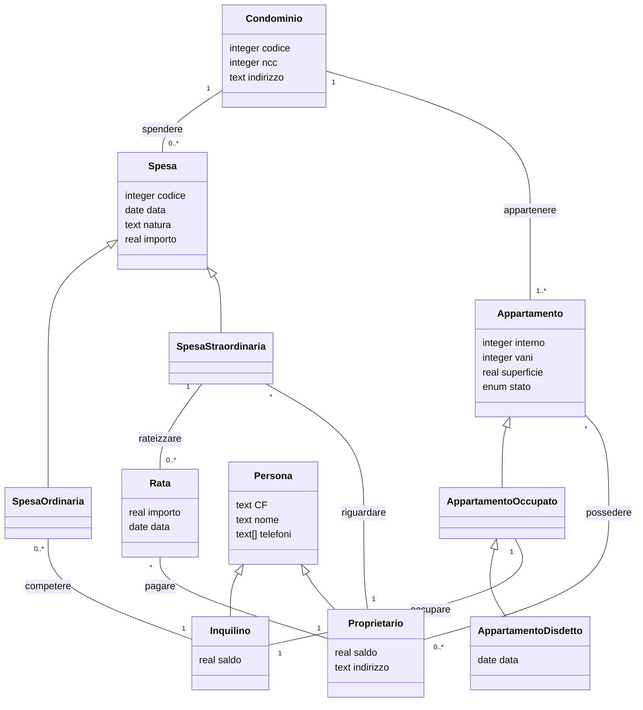
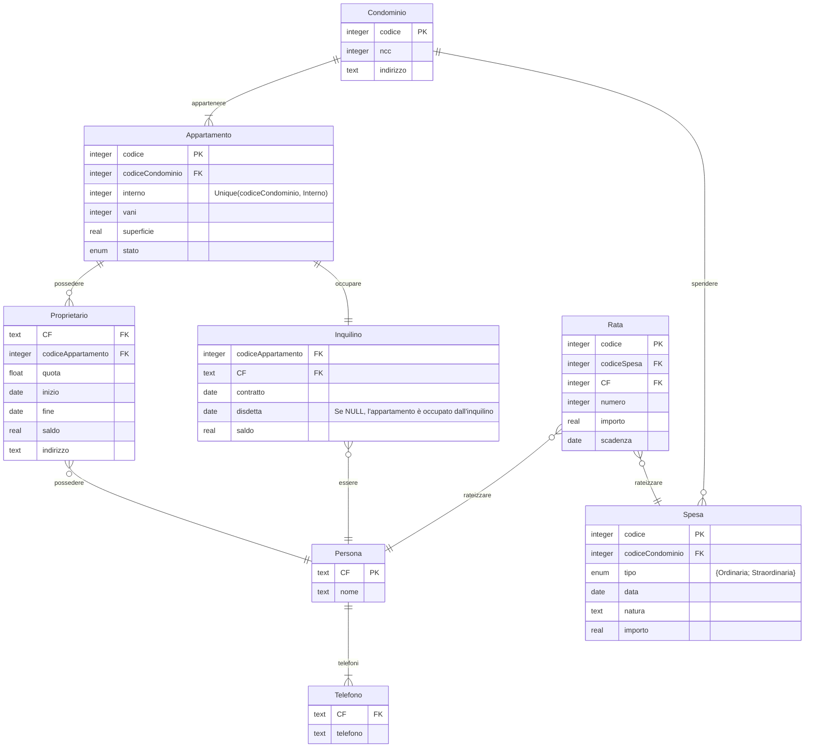

# Esercizi edizione 2021

**FONDAMENTI DI BASI DI DATI**, _Antonio Albano_, _Giorgio Ghelli_, _Renzo Orsini_

Copyright c 2005-2021 A. Albano, G. Ghelli, R. Orsini

Si concede il diritto di riprodurre gratuitamente questo materiale con qualsiasi
mezzo o formato, in parte o nella sua interezza, per uso personale o per uso
didattico alle seguenti condizioni: le copie non sono fatte per profitto o a scopo
commerciale; la prima pagina di ogni copia deve riportare questa nota e la citazione
completa, incluso il titolo e gli autori. Altri usi di questo materiale inclusa la
ripubblicazione, anche di versioni modificate o derivate, la diffusione su server o
su liste di posta, richiede un permesso esplicito preventivo dai detentori del copyright.

## Elenco degli esercizi che si prestano alla realizzazione di DB

### Esercizio 2.5

Si vuole automatizzare il sistema di gestione degli animali in uno zoo.

Di ogni esemplare di animale ospitato, identificato da un codice di inventario, interessano il genere (ad es., zebra), la data di arrivo nello zoo, il nome proprio, il sesso, il paese di provenienza e la data di nascita.

Lo zoo è diviso in aree geografiche di provenienza degli esemplari, con un nome, un responsabile e un insieme di case, ognuna destinata ad un solo genere di esemplari.

Ogni casa è di un certo un tipo (ad es., recinto, tana, grotta, ecc.) e contiene un insieme di gabbie dove vive un solo esemplare. Ogni casa ha un addetto che pulisce ciascuna gabbia in un determinato giorno della settimana.

Gli animali sono sottoposti al loro arrivo, e poi periodicamente, a visite di un veterinario che controlla il peso degli esemplari, diagnostica un'eventuale malattia e prescrive il tipo di dieta da seguire.

**Dare uno schema grafico della base di dati**.

#### Ipotesi soluzione

```plantuml
hide methods
title Zoo

class Esemplare {
  **codInventario**
  //codGenere//
  dataArrivo
  dataNascita
  nome
  sesso
  //codPaese//
}

class GenereTassonomico {
  **codGenere**
  genere
}

Esemplare "n" -- "1" GenereTassonomico: genere >

class Paese {
  **codPaese**
  nomePaese
}

Esemplare "n" -- "1" Paese : provenienza >

class AreaGeografica {
  **codAreaGeografica**
  nome
}

Paese "n" -- "1" AreaGeografica : appartenenza >

class Responsabile {
  **codResponsabile**
  nome
  cognome
}

AreaGeografica "n" -- "1" Responsabile : risponde <

class Casa {
  **codCasa**
  //codAreaGeografica//
  //codTipo//
  //codAddetto//
  giornoPulizie
}

Casa "n" -- "1" AreaGeografica : situata >
Casa "n" -- "1" GenereTassonomico : destinata >

class TipoCasa {
  **codTipo**
  descrizione
}

Casa "n" -- "1" TipoCasa : tipologia >

class Gabbia {
  **codGabbia**
  //codCasa//
  //codInventario//
}

Casa "1" -- "n" Gabbia : collocata <
Gabbia "1" -- "1" Esemplare : vive <

class Addetto {
  **codAddetto**
  nome
  cognome
}

Casa "n" -- "1" Addetto : pulisce <

class Veterinario {
  **codVeterinario**
  cognome
  nome
}

class Visita {
  **codInventario**
  **codVeterinario**
  **data**
   peso
   referto
   dieta
}

Esemplare "1" -- "n" Visita : soggettoA >
Veterinario "1" -- "n" Visita : effettua >
```

### Esercizio 2.6

Una banca gestisce informazioni sui mutui dei propri clienti e le rate del piano di ammortamento.

Un cliente può avere più di un mutuo.

Ai clienti viene inviato periodicamente un resoconto sulle rate pagate del tipo mostrato in figura.

Per le rate pagate dopo la data di scadenza è prevista una mora.

Si progetti la base di dati e successivamente si modifichi lo schema per trattare anche il fatto che i clienti fanno prima una richiesta di mutuo che poi può essere concesso con un rimborso a rate secondo un certo piano di ammortamento.

### Resoconto mutuo

### Intestazione

| **Codice mutuo:** | **250**          | **Data: 07/01/2018** |
| ----------------- | ---------------- | -------------------- |
| Scadenza:         | 01/01/2020       |
| Ammontare:        | 22 000,00        |
| Codice cliente:   | 2000             |
| Nome cliente:     | Mario Rossi      |
| Indirizzo:        | Via Roma, 1 Pisa |

### Dati

| **Numero rata** | **Scadenza** | **Ammontare** | **Data Versamento** |
| :-------------: | :----------: | ------------: | ------------------: |
|      **1**      |  01/07/2018  |       6000,00 |          29/06/2018 |
|      **2**      |  01/01/2019  |       6000,00 |          30/12/2018 |
|      **3**      |  01/07/2019  |       6100,00 |          29/06/2019 |
|      **4**      |  01/01/2020  |       6100,00 |          30/12/2019 |

## Esercizio 2.7

Si vogliono trattare informazioni su attori e registi di film.

Di un attore o un regista interessano il nome, che lo identifica, l'anno di nascita e la nazionalità. Un attore può essere anche un regista.

Di un film interessano il titolo, l'anno di produzione, gli attori, il regista e il produttore. Due film prodotti lo stesso anno hanno titolo diverso.

Dare uno schema grafico della base di dati.

## Esercizio 2.8

Un'azienda vuole gestire le informazioni riguardanti gli impiegati, i dipartimenti e i progetti in corso.

Di un impiegato interessano il codice, assegnato dall'azienda, che l'identifica, il nome e cognome, l'anno di nascita, il sesso e i familiari a carico, dei quali interessano il nome, il sesso, la relazione di parentela e l'anno di nascita.

Di un dipartimento interessano il numero, che lo identifica, il nome, la città dove si trova.

Di un progetto interessano il numero, che lo identifica, e il codice. Un progetto è gestito da un solo dipartimento.

Gli impiegati afferiscono ad un dipartimento, che gestisce più progetti ed è diretto da un impiegato. Gli impiegati partecipano a più progetti, che si svolgono presso dipartimenti di città diverse, ad ognuno dei quali dedicano una percentuale del proprio tempo. Gli impiegati sono coordinati da un responsabile, che è un impiegato. Dei direttori e dei responsabili interessa l'anno di nomina.

Dare uno schema grafico della base di dati.

Usando la base di dati relazionale ottenuta dall'Esercizio 2.8, formulare in SQL le seguenti interrogazioni:

1. Trovare il nome e l'anno di nascita dei figli dell'impiegato con codice 350.
2. Trovare il nome e codice degli impiegati e il nome del dipartimento dove lavorano.
3. Trovare il nome degli impiegati, il nome e l'anno di nascita dei figli maschi a carico.
4. Trovare, per ogni progetto in corso a Pisa, il numero e il nome del progetto, il nome del dipartimento dove si svolge, il cognome del direttore del dipartimento.
5. Trovare il nome dei dipartimenti con almeno un impiegato con persone a carico.
6. Trovare il numero degli impiegati del dipartimento di Informatica.
7. Trovare, per ogni progetto al quale lavorano più di due impiegati, il nome, il numero e il numero degli impiegati che vi lavorano.
8. Trovare per ogni dipartimento il nome, il numero degli impiegati e la media del loro anno di nascita.
9. Trovare i nomi dei supervisori e dei loro dipendenti.
10. Trovare il nome degli impiegati e il nome del dipartimento in cui lavorano.
11. Trovare il nome degli impiegati senza familiari a carico.
12. Trovare i progetti cui partecipa il sig. Rossi come impiegato o come direttore del dipartimento che gestisce il progetto.
13. Trovare il nome degli impiegati che hanno i familiari a carico dello stesso sesso.
14. Trovare il nome degli impiegati che hanno tutti i familiari a carico dello stesso sesso dell'impiegato.
15. Trovare il nome degli impiegati che lavorano almeno a tutti i progetti dell'impiegato con codice 300.
16. Trovare il nome del dipartimento e il numero di impiegati nati dopo il 1950, per i dipartimenti con più di due impiegati.

## Esercizio 3.1

Condomìni Si supponga di dover memorizzare in una base di dati le informazioni di interesse per un amministratore di condomìni.

Di un condominio interessano l'indirizzo e il numero del conto corrente dove vengono fatti i versamenti per le spese sostenute. Un condominio si compone di un certo numero di appartamenti, dei quali interessano il
numero dell'interno, il numero dei vani, la superficie, lo stato (libero od occupato).
Gli appartamenti possono essere locati ad un inquilino, del quale interessano il nome, il codice fiscale, il telefono e il saldo, cioè la somma che l'inquilino deve all'amministrazione condominiale per le spese sostenute. Alcuni appartamenti locati possono essere stati disdetti, ed in questo caso interessa la data della disdetta. Un appartamento può avere più proprietari, e un proprietario può possedere più appartamenti. Di ogni proprietario interessano il nome, il codice fiscale, l'indirizzo, il telefono e il saldo, cioè la somma che il proprietario deve all'amministrazione condominiale per le spese sostenute.
Le spese riguardano i condomìni e di esse interessano il codice di identificazione, la natura (luce, pulizia, ascensore ecc.), la data e l'importo. Fra le spese si distinguono quelle straordinarie, a carico dei proprietari, e quelle ordinarie, a carico degli inquilini. Le spese ordinarie vengono pagate in un'unica rata, mentre le spese straordinarie possono essere pagate in più rate e di ognuna di esse occorre ricordare la data e l'importo.

Progettare lo schema della base di dati e dare la specifica delle operazioni per l'immissione dei dati.

### Bozza della soluzione

#### Modello concettuale



Le spese o sono ordinarie oppure sono straordinarie. Gli insiemi delle due spese sono disgiunti (vincolo di disgiunzione) e la loro unione forma l'insieme di tutte le spese (vincolo di copertura).

Rispetto al testo, i nomi delle classi sono al singolare, il tipo enumerazione è indicato con _enum_ senza esplitarne i possibili valori, il tipo sequenza è indicato con le parentesi quadre aperta e chiusa, i tipi primitivi sono quelli di _SQLite_ al quale ho aggiunto _date_. Con la notazione di Mermaid non sono riuscito ad indicare i vincoli di disgiunzione e di copertura.

##### Operazioni

NuovaPersona
Inserisce i dati di una persona

NuovoCondominio
Inserisce un condominio e tutti i suoi appartamenti e i loro proprietari (che
devono essere gia inseriti come persone).

NuovoContrattoDiAffitto
Inserisce un affittuario e lo collega all’appartamento affittato.

NuovaSpesaOrdinaria
Inserisce i dati di una nuova spesa ordinaria e incrementa i saldi degli inquilini a cui si riferisce.

NuovaSpesaStraordinaria
Inserisce i dati di una nuova spesa straordinaria, incluse le rate, e incrementa i relativi saldi dei proprietari.

| **Operazione** | NuovoCondominio                                             |
| -------------- | ----------------------------------------------------------- |
| **Scopo**      | Immissione dei dati di un nuovo condominio                  |
| **Argomenti**  | codice: integer, ncc: integer, appartamenti: Appartamenti[] |
| **Risultato**  | (OperazioneEseguita, Errore)                                |
| **Errori**     | vani < 1, superficie errata, codice già usato               |
| **Moodifica**  | Condomini, Appartamenti                                     |

#### Ristrutturazione del modello concettuale



Le modifiche al modello richiedono l'aggiunta di vincoli per il controllo degli inserimenti.

#### DDL - SQL

```sql
CREATE TABLE Condominio (
    codice INTEGER PRIMARY KEY,
    nCC INTEGER UNIQUE,
    indirizzo TEXT
);

CREATE TABLE Spesa (
    codice INTEGER PRIMARY KEY,
    codiceCondominio INTEGER NOT NULL
        REFERENCES Condominio(codice),
    tipo TEXT CHECK (
        tipo IN ('Ordinaria', 'Straordinaria')
        ),
    data TEXT CHECK(
        data IS strftime('%Y-%m-%d', data)
        ),
    natura TEXT,
    importo REAL CHECK (importo > 0)
    -- le voci in attivo non vengono considerate
);

CREATE TABLE Appartamento (
    codice INTEGER PRIMARY KEY,
    codiceCondominio INTEGER NOT NULL
        REFERENCES Condominio(codice),
    interno INTEGER NOT NULL,
    vani INTEGER CHECK (vani > 1),
    superficie REAL CHECK (superficie > 0),
    UNIQUE (codiceCondominio, Interno)
);

CREATE TABLE Persona (
    CF TEXT PRIMARY KEY,
    -- andrebbero fatti vari controlli...
    nome TEXT
);

CREATE TABLE Telefono (
    CF TEXT NOT NULL
        REFERENCES Persona(CF),
    telefono TEXT
);

CREATE TABLE Inquilino (
    CF TEXT
        REFERENCES Persona(CF),
    codiceAppartamento INTEGER
        REFERENCES Appartamento(codice),
    contratto TEXT CHECK(
        contratto IS strftime('%Y-%m-%d', contratto)
        ),
    disdetta TEXT CHECK(
        disdetta IS NULL OR disdetta IS strftime('%Y-%m-%d', disdetta)
        ),
    saldo REAL,
    PRIMARY KEY(CF, codiceAppartamento, contratto)
);

CREATE TABLE Proprietario (
    CF TEXT
        REFERENCES Persona(CF),
    codiceAppartamento INTEGER
        REFERENCES Appartamento(codice),
    inizio TEXT CHECK(
        inizio IS NULL OR inizio IS strftime('%Y-%m-%d', inizio)
        ),
    fine TEXT CHECK(
        fine IS NULL OR fine IS strftime('%Y-%m-%d', fine)
        ),
    quota REAL CHECK (quota BETWEEN 0 AND 1),
    saldo REAL,
    indirizzo TEXT,
    PRIMARY KEY(CF, codiceAppartamento)
    -- un proprietario non può modificare le quote di possesso, vendere e ricomprare un appartamento
);

CREATE TABLE Rata (
    codice INTEGER PRIMARY KEY,
    codiceSpesa INTEGER NOT NULL
        REFERENCES Spesa(codice),
    CF TEXT
        REFERENCES Persona(CF),
    numero INTEGER,
    importo REAL CHECK (importo > 0),
    scadenza TEXT CHECK(
        scadenza IS strftime('%Y-%m-%d', scadenza)
        )
    -- La rata viene emessa per singolo proprietario in base alla quota di possesso
);
```

## Esercizio 3.2

Società Mega S.p.A. Si vogliono gestire informazioni riguardanti gli impiegati, le loro competenze, i progetti a cui partecipano e i dipartimenti a cui appartengono. Ogni impiegato ha una matricola che lo identifica, assegnata dalla società. Di ogni
impiegato interessano il nome, la data di nascita e la data di assunzione. Se un impiegato è coniugato con un altro dipendente della stessa società, interessano la data del matrimonio e il coniuge. Ogni impiegato ha una qualifica (ad esempio, segretaria, impiegato, programmatore, analista, progettista ecc.). Dei laureati e delle segretarie interessano altre informazioni. Dei laureati interessa il tipo di laurea e delle segretarie le lingue straniere conosciute.
La società è organizzata in dipartimenti, caratterizzati da un nome e da un numero di telefono. Un impiegato afferisce ad un solo dipartimento. Ogni dipartimento si approvvigiona presso vari fornitori e un fornitore può rifornire più dipartimenti. Di ogni fornitore interessano il nome e l'indirizzo. Interessano, inoltre, la data e il fornitore dell'ultimo acquisto fatto da un dipartimento. La società lavora a diversi progetti, ciascuno dei quali è localizzato in una città. Più impiegati partecipano ad un progetto e un impiegato può partecipare a più progetti, ma tutti localizzati sulla stessa città. Di ogni città con un progetto in corso interessano la sua popolazione e la regione. Un impiegato può avere più competenze, ma usarne solo alcune per un particolare progetto. Un impiegato usa ogni sua competenza in almeno un progetto. Ad ogni competenza è assegnato un codice unico e una descrizione. I progetti in corso sono identificati da un numero ed interessa una stima del loro costo.

Progettare lo schema della base di dati.

## Esercizio 3.3 Anagrafe

Si vogliono trattare informazioni sulle persone che vivono o sono decedute in un comune italiano.

Di una persona interessano: nome, cognome, codice fiscale, data di nascita (giorno, mese, anno), sesso (m, f) madre, e padre.

Una persona può essere vivente o deceduta. Di una persona vivente interessano: numero di cellulare, stato civile (celibe (nubile), coniugato(a), vedovo(a), separato(a), divorziato(a)), e i familiari conviventi.
Le persone di un nucleo familiare condividono lo stesso indirizzo (via, numero, cap, località), telefono e comune di residenza.
Di una persona deceduta interessano: data del decesso, età al momento del decesso, comune del decesso, comune dove è stata seppellita.
Di un matrimonio interessano: data del matrimonio, le due persone che si sono unite in matrimonio e il comune dove è stato celebrato.
Di un comune interessano: nome, se capoluogo di provincia, prefisso telefonico, gli abitanti, il numero degli abitanti, il numero delle persone seppellite e decedute.

Vanno previste le seguenti operazioni; si usi questa lista per verificare che il modello della base di dati contenga tutti i dati necessari alla loro realizzazione.

1. creazione di una persona;
2. nascita di un figlio;
3. matrimonio;
4. antenati viventi di una persona;
5. nome e cognome dei genitori di una persona;
6. nome, cognome e relazione di parentela dei familiari conviventi di una persona;
7. figli viventi e figli conviventi di una persona;
8. cambio di residenza di una persona e dei suoi familiari conviventi;
9. una persona e i suoi conviventi vanno a vivere con un'altra persona;
10. una persona va a vivere da sola;
11. decesso di una persona.

## Esercizio 3.4

### Ufficio della motorizzazione

Si vogliono modellare i seguenti fatti di interesse di un ipotetico Ufficio della motorizzazione.

### Produttori di automobili

C'è un certo numero di produttori di automobili, ciascuno identificato da un nome (FIAT, FORD ecc.). I dati di nuovi produttori possono essere immessi in ogni momento, se il produttore ha l'autorizzazione ad iniziare l'attività commerciale.
L'autorizzazione non può essere ritirata e non più di cinque produttori possono essere in attività contemporaneamente. Un produttore è considerato attivo finch e possiede automobili registrate come prodotte da lui e non ancora vendute; nel momento in cui un produttore non possiede auto, il suo permesso di operare può essere sospeso.
I dati di un produttore vengono eliminati solo quando viene eliminata la storia di tutte le auto da lui prodotte.

### Automobili

Un'automobile è caratterizzata da un modello, dall'anno di produzione, da un numero di serie assegnatogli dal produttore, unico fra le automobili da lui prodotte. I dati di un'automobile vengono immessi all'atto della sua registrazione presso l'Ufficio della Motorizzazione. Al momento della registrazione, all'automobile viene assegnato un numero, unico per ciascuna automobile e non modificabile, e la data di registrazione. Il produttore viene registrato come primo proprietario. Un'automobile può essere registrata in qualsiasi giorno dell'anno in cui è stata costruita, ma può essere registrata solo entro il 31 gennaio se costruita l'anno precedente. Nel caso di distruzione, viene registrata la data di distruzione, e da questo momento l'automobile non può essere più trasferita. Infine, la storia di un'automobile va conservata
per due anni dopo la sua distruzione.

### Modelli di automobile

Ogni automobile è caratterizzata da un modello (Panda, Uno, Escort ecc.). Le automobili di ciascun modello sono prodotte dallo stesso produttore, il quale è libero di introdurre nuovi modelli sul mercato in qualsiasi momento. Il nome di ciascun modello è unico fra tutti i modelli registrati. Le automobili di uno stesso modello hanno lo stesso consumo di benzina. Un modello ha una potenza di almeno 6 cavalli e una cilindrata compresa fra 400 e 3.000 cc.
I dati su un modello vanno conservati finch ́e esiste nella base di dati un'automobile di tale modello. Le automobili di un certo modello non possono essere registrate se tale modello non è ancora noto all'Ufficio della motorizzazione.

### Rivenditori

I rivenditori sono preposti alla distribuzione di automobili nuove, o usate, ai privati. Di un rivenditore interessano il nome, l'indirizzo, il telefono e l'eventuale numero del fax. Nuovi rivenditori possono sorgere in ogni momento, ma la loro attività commerciale può iniziare solo se hanno ricevuto il permesso dagli uffici competenti. Un rivenditore può trattare automobili nuove di al più tre produttori diversi.
Ogni rivenditore è considerato operante finche possiede automobili; in caso contrario può richiedere la sospensione del permesso di operare. I dati di un rivenditore non operante vengono eliminati solo se questo non è stato proprietario di un'auto di cui
si conserva la storia.

### Privati

I privati sono persone proprietarie di una o più automobili già registrate. Di un privato
interessano il nome, l'indirizzo e il telefono. I dati dei privati vengono immessi con l'acquisto della prima automobile, ed eliminati solo se essi non sono stati proprietari di un'automobile di cui si conserva la storia.

### Trasferimenti di proprietà

In ogni momento un'automobile può essere posseduta: dal suo produttore (automobile invenduta), da un rivenditore, oppure da un gruppo di privati. All'atto del trasferimento della proprietà di un'automobile vengono registrate le seguenti informazioni: un codice che identifica il trasferimento, la data di trasferimento, l'automobile trasferita, il vecchio e il nuovo proprietario.
Vi sono norme che vincolano il trasferimento di un'automobile:

- un'automobile distrutta non può essere trasferita;
- un'automobile può essere venduta da un produttore solo ad un rivenditore, e un produttore non può acquistare automobili;
- un'automobile può essere venduta da un rivenditore solo a privati o gruppi di privati.

I dati su un trasferimento possono essere eliminati solo quando l'automobile cessa di essere di interesse per l'Ufficio della Motorizzazione.

Si usino le seguenti operazioni previste sul sistema per verificare che possono essere realizzate.

- Registrazione di una nuova auto.
- Distruzione di un'auto.
- Registrazione della vendita di un'auto.
- Eliminazione della storia delle auto distrutte da almeno due anni.
- Registrazione di un nuovo produttore in attesa del permesso di operare.
- Autorizzazione di un produttore ad operare.
- Sospensione delle attività di un produttore.
- Eliminazione di un produttore non operante.
- Registrazione di un nuovo modello.
- Registrazione di un nuovo rivenditore.
- Sospensione delle attività di un rivenditore.
- Eliminazione di un rivenditore non operante.

## Esercizio 3.5

### Organizzazione di una conferenza

Si vogliono trattare i dati riguardanti le Working Conferences dell'IFIP (International Federation for Information Processing).

L'IFIP è una organizzazione federativa che raggruppa 48 associazioni nazionali e accademie scientifiche che operano nell'area della tecnologia dell'informazione.

Ogni membro ha un nome e il paese di appartenenza (ad es. Associazione Italiana per l'Informatica ed il Calcolo Automatico, Italia). Le attività dell'IFIP sono coordinate da 13 Technical Committees (TC), a loro volta divisi in oltre 100 Working Groups (WG) ai quali appartengono oltre 3.500 esperti (professionisti ICT e ricercatori di tutto il mondo).

Ogni Technical Committee copre un aspetto particolare dell'informatica e delle discipline correlate (ad es. TC 1: Foundations of Computer Science: WG 1.1 Continuous Algorithms and Complexity, WG 1.2 Descriptional Complexity, ecc.).

I Working Groups organizzano conferenze alle quali possono partecipare solo esperti
membri dei Working Groups e Technical Committees che hanno ricevuto un invito.

Di un esperto interessano il codice, che lo identifica, il nome, la nazione, l'ente di appartenenza, l'email e il telefono.

Di una conferenza interessano la sigla, che la identifica, il titolo, l'anno, il luogo, le date di inizio e fine, la soglia minima e massima dei partecipanti ai lavori per garantirsi la copertura dei costi e per non superare le capacità ricettive delle strutture.

Delle sessioni di una conferenza interessano il titolo, la sala, la data e l'ora di inizio e fine.

La conferenza è organizzata da tre comitati di esperti:

1. il Comitato Organizzatore per curare gli aspetti finanziari, logistici, gli inviti e la pubblicità,
2. il Comitato di Programma per curare gli aspetti scientifici della conferenza;
3. Comitato dei Revisori, nominato dal Comitato di Programma, per esaminare gli articoli sottoposti alla conferenza, e decidere quali articoli accettare, non superando il numero massimo prestabilito.

È previsto un Chairman per ogni comitato e un General Chairman per la conferenza.

Tutti i comitati lavorano utilizzando dati comuni che vanno raccolti ed elaborati in modo consistente.

### Procedure da automatizzare

L'applicazione da realizzare ha lo scopo di agevolare
le attività del Comitato di Programma e del Comitato Organizzatore, pensati come due settori aziendali che operano utilizzando dati in comune. I comitati devono svolgere le seguenti attività.

### Comitato di Programma

- Preparare la lista degli esperti a cui sollecitare la presentazione di un articolo.
- Registrare le lettere d'intenti, cioè le risposte date da coloro che intendono inviare un lavoro. Ogni esperto invia al più una lettera che verrà presa in considerazione solo se perviene entro la data prestabilita. I lavori con nessun autore fra gli esperti che hanno risposto con una lettera d'intenti avranno una priorità bassa, se il numero complessivo dei lavori da esaminare supera il massimo prestabilito.

### Comitato Organizzatore

- Preparare la lista degli esperti da invitare alla conferenza. Nella lista devono essere inclusi: i membri di tutti i Technical Committees e Working Groups interessati; i membri del Comitato dei Revisori e tutti coloro che hanno proposto un articolo. Occorre evitare di mandare alla stessa persona più di un invito.

- Registrare le adesioni alla conferenza pervenute entro la data prefissata.
- Generare la lista finale dei partecipanti alla conferenza. Se le adesioni superano il numero massimo prestabilito, verrà data priorità, nell'ordine, ai membri dei Technical Committees, ai membri dei Working Groups e del Comitato dei Revisori, agli autori degli articoli ammessi alla conferenza, agli autori degli articoli rifiutati.
- Registrare gli articoli proposti per la conferenza e pervenuti entro una data prefissata.
- Distribuire i lavori fra i membri del Comitato dei Revisori. Ogni lavoro sarà revisionato da 3 a 5 revisori, a seconda del numero complessivo dei lavori pervenuti.
- Raccogliere i pareri dei revisori e selezionare il numero prefissato di lavori da presentare alla conferenza.
- Raggruppare i lavori selezionati in sessioni e scegliere un Chairman per ogni sessione fra i membri del Comitato di Programma.

```

```
