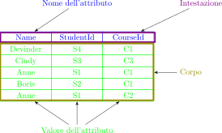

<!--
author:   Gionata Massi

email:    gionata.massi@savoiabenincasa.it

version:  0.0.1

language: it

narrator: IT Italian Male

comment:  Un corso in 10 incontri per scoprire, in modo pratico, la teoria delle basi
          di dati relazionali.

script:   https://cdnjs.cloudflare.com/ajax/libs/railroad-diagrams/1.0.0/railroad-diagrams.min.js
script:   https://cdn.jsdelivr.net/gh/gionatamassibenincasa/database-didattici/algebra_delle_relazioni/js/relations.js

link:     https://cdnjs.cloudflare.com/ajax/libs/railroad-diagrams/1.0.0/railroad-diagrams.min.css

-->

# Algebra delle relazioni <br> Un approccio pratico<!-- style="color: blue" --> alla teoria<!-- style="color: red" --> delle basi di dati

Un corso in 10 incontri per scoprire, in modo pratico, la teoria delle basi di dati relazionali.

> Per visualizzare questo documento come una versione interattiva fornita da LiaScript,
> fare clic sul seguente collegamento/badge:
>
> [](https://liascript.github.io/course/?https://raw.githubusercontent.com/gionatamassibenincasa/database-didattici/main/algebra_delle_relazioni/README.md)

Web application complementare (calcolatrice): https://gionata.github.io/relax/

|Diapositive|Calcolatrice|
|:---:|:---:|
|[qr-code](https://liascript.github.io/course/?https://raw.githubusercontent.com/gionatamassibenincasa/database-didattici/main/algebra_delle_relazioni/README.md)|[qr-code](https://gionata.github.io/relax/)|

Crediti:

* Hugh Darwen, *An Introduction to Relational Database Theory*. 2014

## Introduzione

Uno sguardo su

* cos'è un database
* cos'è un database relazionale, in particolare
* cos'è un sistema di gestione dei database (DBMS)
* cosa fa un DBMS
* come un DBMS relazionale fa quello che fa un DBMS

### Cos'è un database?

> Un **database** è una raccolta *organizzata* di *simboli*  leggibile da una macchina, da _interpretare_ come un fedele resoconto di un'organizzazione. Un database è anche aggiornabile da una macchina, e quindi deve essere anche una raccolta di _variabili_. Un database è in genere disponibile per una comunità di utenti, con requisiti variabili nel tempo.
>
> -- Hugh Darwen, An Introduction to Relational Database Theory. 2014

#### una raccolta *organizzata* di *simboli*

Un esempio di raccolta *organizzata* di *simboli*

<script>
addHTMLTable(`||
|StudentId|Name|CourseId|
|---------|----|--------|
|S1|Anne|C1|
|S1|Anne|C2|
|S2|Boris|C1|
|S3|Cindy|C3|`);
</script>

**Figura 1.1: Una raccolta organizzata di simboli**

{{1}}
Riesci a indovinare cosa potrebbe voler dirci questa disposizione tabulare di simboli?
Cosa potrebbe significare che i simboli appaiano nella stessa riga?
E nella stessa colonna?
In che modo il significato dei simboli nella prima riga (mostrati in neretto) potrebbe differire dal significato di quelli sottostanti?

{{2}}
Riesci a indovinare intuitivamente che i simboli sotto la prima riga nella prima colonna sono tutti identificatori di studenti, quelli nella seconda colonna nomi di studenti e quelli nella terza identificatori di corsi? Riesci a indovinare che il nome della studentessa S1 è Anne? E che Anne è iscritta ai corsi C1 e C2? E che Cindy non è iscritta a nessuno di quei due corsi? In tal caso, quali caratteristiche dell'organizzazione dei simboli ti hanno portato a queste ipotesi?

{{3}}
Ricorda quelle caratteristiche. In modo informale, costituiscono il fondamento della teoria relazionale. Ognuna di esse ha una controparte formale nella teoria relazionale e quelle controparti formali sono gli unici costituenti della struttura organizzata che è un database relazionale.

#### da interpretare come un fedele resoconto

Per esempio

<script>
addHTMLTable(`||
|StudenteId|Nome|CorsoId|
|---------|----|--------|
|S1|Anne|C1|`);
</script>

Forse quei simboli in carattere normale, organizzati come sono rispetto a quelli in neretto, devono essere intesi nel senso:

"La studentessa S1, di nome Anne, è iscritta al corso C1."


{{1}}
Una cosa importante è che solo alcuni simboli della frase tra virgolette compaiono nella tabella: S1, Anne e C1.
Nessuna delle altre parole compare nella tabella.
I simboli nella riga superiore della tabella (presumibilmente intestazioni di colonna) potrebbero aiutarci a indovinare "studente", "nome" e "corso", ma nulla nella tabella accenna a "iscritto". E anche se quelle intestazioni di colonna presunte fossero state A, B e C, o X, Y e Z, l'interpretazione data potrebbe comunque essere quella voluta.

{{2}}
Ora, possiamo prendere la frase "La studentessa S1, di nome Anne, è iscritta al corso C1" e sostituire ciascuno di S1, Anne e C1 con i simboli corrispondenti presi da un'altra riga della tabella, come S2, Boris e C1. Così facendo, stiamo applicando esattamente la stessa modalità di interpretazione a ogni riga.

{{3}}
Se è davvero così che la tabella deve essere interpretata, allora possiamo concludere che le seguenti frasi sono tutte vere:

{{3}}

* La studentessa S1, di nome Anne, è iscritta al corso C1.
* La studentessa S1, di nome Anne, è iscritta al corso C2.
* Lo studente S2, di nome Boris, è iscritto al corso C1.
* La studentessa S3, di nome Cindy, è iscritta al corso C3.


####  raccolta di variabili

Guarda questa nuova tabella con una piccola modifica

<script>
addHTMLTable(`|Iscrizione|
|StudentId|Name|CourseId|
|S1|Anne|C1|
|S1|Anne|C2|
|S2|Boris|C1|
|S3|Cindy|C3|
|S4|Devinder|C1|`);
</script>

**Figura 1.2: Una variabile che rappresenta suo valore corrente**

{{1}}
Abbiamo aggiunto un *nome*, `Iscrizione`, sopra la tabella, ed una riga aggiuntiva.

`Iscrizione` è una **variabile**.
 Forse la tabella in fig. 1.1 era un suo **valore** precedente.
 Se così fosse, la variabile è stata *aggionata* con l'aggiunta della riga per S4.
 
La nostra interpretazione della fig. 1.1 deve essere rivista alla luce della nuova riga:

* La studentessa S1, di nome Anne, è iscritta al corso C1.
* La studentessa S1, di nome Anne, è iscritta al corso C2.
* Lo studente S2, di nome Boris, è iscritto al corso C1.
* La studentessa S3, di nome Cindy, è iscritta al corso C3.
* Lo studente  S4, di nome Devinder, è iscritto al corso C1.

{{2}}

Conosci la [logica delle proposizioni](https://it.wikipedia.org/wiki/Logica_proposizionale)?

{{2}}
Nota che in italiano possiamo unire tutte queste frasi per formare una frase singola, usando congiunzioni come "e", "o", "ma", "perché" e così via.
Se le uniamo usando in particolare con "e", che per noi è anche un **connettivo logico**, otteniamo una frase singola che è logicamente equivalente all'insieme di frasi sopra scritte, nel senso che la nuova proposizione è vera se delle proposizioni che la compone è vera (e falsa se una qualsiasi di esse è falsa). Un database, quindi, può essere pensato come una rappresentazione di un resoconto dell'organizzazione espresso come una frase singola, ma è più comune pensare in termini di una raccolta di singole frasi.

{{3}}

Potremmo anche essere in grado di concludere che le seguenti frasi (ad esempio) sono false:

* Lo studente S2, di nome Boris, è iscritto al corso C2.
* Lo studente S2, di nome Beth, è iscritto al corso C1.

{{4}}

Ogni volta che la variabile viene *aggiornata*, l'insieme di frasi (proposizioni) vere rappresentato dal suo valore cambia in qualche modo.

Gli aggiornamenti di solito riflettono i cambiamenti che osserviamo nell'organizzazione, influenzando le nostre convinzioni su di essa e quindi il nostro resoconto su di essa.

### Cos'è un database relazionale?

Un database relazionale è un database i cui simboli sono organizzati in una raccolta di relazioni.
La Figura 1.3 conferma che gli esempi che abbiamo già visto sono in effetti relazioni, rappresentate in forma tabellare. Infatti, secondo la Figura 1.2, la relazione rappresentata nella Figura 1.3 è il valore corrente della variabile `Iscrizione`.

<script>
  addHTMLTable(`||
|StudentId|Name|CourseId|
|---|---|---|
|S1|Anne|C1|
|S1|Anne|C2|
|S2|Boris|C1|
|S3|Cindy|C3|
|S4|Devinder|C1|`);
</script>

**Figura 1.3: Una relazione rappresentata in forma tabellare**

La rappresentazione visiva (tabellare) che abbiamo utilizzato finora è particolarmente adatta ai database relazionali: tanto che molte persone usano la parola tabella come alternativa a relazione. Il linguaggio SQL in particolare usa quel termine, quindi nel contesto della teoria relazionale è conveniente e giudizioso attenersi a relazione per il costrutto teorico, consentendo che le deviazioni di SQL dalla teoria relazionale siano notate come differenze tra tabelle e relazioni.

*Relazione* è un termine formale in matematica, in particolare, nel fondamento logico della matematica.

La maggior parte dei testi matematici si concentra sulle relazioni che coinvolgono cose prese in coppia, ma il nostro esempio mostra una relazione che coinvolge cose prese tre alla volta e, come vedremo, le relazioni in generale possono mettere in relazione un numero qualsiasi di cose (e, come vedremo, il numero in questione può anche essere inferiore a due, rendendo il termine relazione un po' inappropriato).

La teoria dei database relazionali è costruita attorno al concetto di relazione. Il nostro studio della teoria includerà:

- L'"anatomia" di una relazione.
- Algebra relazionale: un insieme di operatori matematici che operano sulle relazioni e producono relazioni come risultati.
- Variabili di relazione: la loro creazione e distruzione e operatori per aggiornarle.
- Operatori di confronto relazionale, che consentono di esprimere le regole di coerenza come vincoli (comunemente chiamati vincoli di **integrità**) sulle variabili che costituiscono il database.

E vedremo come questi e altri costrutti possono costituire la base di un linguaggio di database (in particolare, un linguaggio di database relazionale).

#### “Relazione" $\neq$ “Tabella”

"Tabella", qui, si riferisce a immagini del tipo mostrato nelle Figure 1.1, 1.2 e 1.3. I termini relazione e tabella
non sono sinonimi. Per prima cosa, sebbene ogni relazione possa essere rappresentata come una tabella, esistono tabelle
che non sono una rappresentazione di una relazione. Diremo che tali tabelle non **denotano** una relazione. Inoltre, diverse tabelle possono tutte rappresentare la stessa relazione. Si consideri la Figura 1.4, per esempio.

<script>
addHTMLTable(`||
|Name|StudentId|CourseId|
|---|---|---|
|Devinder|S4|C1|
|Cindy|S3|C3|
|Anne|S1|C1|
|Boris|S2|C1|
|Anne|S1|C2|`);
</script>

**Figura 1.4: La stessa relazione di Figura 1.3**

La tabella nella Figura 1.4 è diversa da quella nella Figura 1.3, ma rappresenta la stessa relazione. Ho cambiato l'ordine delle colonne e l'ordine delle righe, ogni riga verde nella Figura 1.4 ha gli stessi simboli per ogni intestazione di colonna di alcune righe nella Figura 1.3 e ogni riga nella Figura 1.3 ha una riga corrispondente, derivata in quel modo, nella Figura 1.4. Ciò che sto cercando di illustrare è il principio secondo cui la relazione rappresentata da una tabella non dipende dall'ordine in cui posizioniamo le righe o le colonne in quella tabella. Ne consegue che diverse tabelle possono tutte indicare la stessa relazione, perché possiamo semplicemente cambiare l'ordine da sinistra a destra in cui sono mostrate le colonne e/o l'ordine dall'alto verso il basso in cui sono mostrate le righe e tuttavia rappresentare ancora la stessa relazione.

Cosa significa dire che l'ordine delle colonne e l'ordine delle righe non hanno importanza? Scopriremo la risposta a questa domanda quando in seguito studieremo gli operatori tipici definiti per operare sulle relazioni (ad esempio, per calcolare i risultati delle query sul database) e sulle variabili di relazione (ad esempio, per aggiornare il database). Nessuno di questi operatori dipenderà dalla nozione di una riga o di una colonna come prima o ultima, o immediatamente prima o dopo un'altra colonna o riga.

Possiamo anche osservare che non tutte le tabelle rappresentano una relazione. Tali tabelle possono essere facilmente ottenute semplicemente eliminando le righe blu (le intestazioni di colonna) da ciascuna delle Figure 1.1 a 1.4.

 La Figura 1.5 mostra un'altra tabella che non rappresenta alcuna relazione.

<script>
addHTMLTable(`||
|A|B|A|
|---|---|---|
|1|2|3|
|4||5|
|6|7|8|
|9|9|?|
|1|2|3|`);
</script>

**Figura 1.5: Una tabella che non denota una relazione**

### Anatomia di una relazione

La figura 1.6 mostra la terminologia che utilizziamo per riferirci alle parti della struttura di una relazione.



**Figura 1.6. Anatomia di una relazione**


A causa della distinzione tra i termini relazione e tabella, preferiamo non usare la terminologia delle tabelle per le parti anatomiche di una relazione. Utilizziamo invece i termini proposti da E.F. Codd, il ricercatore che per primo propose la teoria relazionale come base per la tecnologia dei database, nel 1969. Prova ad abituarti a questi termini. Potresti non trovarli molto intuitivi. Le loro controparti nella rappresentazione tabellare potrebbero aiutarti:

- relazione : tabella
- (n-)tupla : riga
- attributo : colonna

Inoltre (come mostrato nella Figura 1.6):

Il **grado** è il numero di attributi.

La **cardinalità** è il numero di tuple.

L'**intestazione** (o **schema**) è l'insieme di attributi (nota *insieme*, perché gli attributi non sono ordinati in alcun modo e nessun attributo appare più di una volta).

Il **corpo** è l'insieme di tuple (di nuovo, nota *insieme*: le tuple non sono ordinate e nessuna tupla appare più di una volta).

Un **attributo** ha un nome di attributo e non ce ne sono due con lo stesso nome.

Ogni attributo ha un valore di attributo in ogni tupla.


### Cos'è un DBMS?

Un sistema di gestione di database (DBMS) è esattamente ciò che suggerisce il suo nome: un software per la gestione di database e per fornire accesso a essi.

Un DBMS risponde a _comandi impartiti da *programmi applicativi*, personalizzati o generici, eseguiti per conto degli utenti. I comandi sono scritti nel linguaggio del database del DBMS (ad esempio, `SQL`).

Per supportare più utenti simultanei, un DBMS normalmente funziona come un server. I suoi utenti immediati sono quindi quei programmi applicativi, eseguiti come client di questo server, in genere (anche se non necessariamente) per conto di *utenti finali*. Pertanto, è necessario un qualche tipo di protocollo di comunicazione per la trasmissione di comandi e risposte tra client e server. Prima di inviare comandi al server, un programma applicativo client deve prima stabilire una connessione con esso, avviando così una sessione, che in genere dura finché il client non ne chiede esplicitamente la terminazione. Questo è tutto ciò che devi sapere sull'architettura client-server per quanto riguarda questo libro.

<script>
// Questo documento riguarda in particolare i DBMS relazionali e i database relazionali, e presto esamineremo i componenti che ci aspettiamo di trovare in un DBMS relazionale. Prima di ciò, dobbiamo rivedere brevemente cosa ci si aspetta da un DBMS in generale.
</script>

### Cos'è un linguaggio di database?

I comandi forniti a un DBMS da un'applicazione sono scritti nel linguaggio di database del DBMS. Il termine *sottolinguaggio dei dati* è talvolta utilizzato al posto di linguaggio di database. Il prefisso *sotto* si riferisce al fatto che i programmi applicativi sono talvolta scritti in un linguaggio di programmazione più generico (il linguaggio "host"), in cui i comandi del linguaggio di database sono incorporati in uno stile predefinito. 

Una query è un'espressione che, quando valutata, produce un risultato derivato dal database. **Le query sono ciò che rende utili i database**. Si noti che una query non è di per sé un comando. Il DBMS potrebbe supportare un qualche tipo di comando per valutare una determinata query e rendere il risultato disponibile per l'accesso, anche tramite comandi DBMS, da parte del programma applicativo. Il programma applicativo potrebbe eseguire tali comandi per visualizzare un risultato di query (solitamente in forma tabellare) in una finestra.

### Cosa fa un DBMS?

In risposta alle richieste dei programmi applicativi, ci aspettiamo che un DBMS sia in grado, ad esempio, di

- creare e distruggere variabili nel database
- prendere nota delle regole di integrità (vincoli)
- prendere nota delle autorizzazioni (chi è autorizzato a fare cosa, a quale cosa)
- aggiornare le variabili (rispettando vincoli e autorizzazioni)
- fornire risultati di query

Per amplificare alcuni dei termini appena usati:

Le richieste assumono la forma di comandi scritti nel linguaggio del database supportato dal DBMS.

Le variabili sono i costituenti del database, come la variabile `Iscrizione` che abbiamo esaminato in precedenza.

Tali variabili sono sia **persistenti** che **globali**.

Una variabile *persistente* è una variabile che cessa di esistere solo quando la sua distruzione è richiesta esplicitamente da un utente.

Una variabile *globale* è una variabile che esiste indipendentemente dai programmi applicativi che la utilizzano, distinguendola da una variabile locale, dichiarata all'interno del programma applicativo e automaticamente distrutta quando l'unità di programma ("blocco") in cui è dichiarata termina la sua esecuzione.

I **vincoli** (talvolta chiamati  **vincoli di integrità**) sono regole che disciplinano i valori ammissibili e le combinazioni ammissibili di valori delle variabili. Ad esempio, potrebbe essere possibile dire al DBMS che il punteggio di valutazione degli studente non può essere inferiore a zero.

Un database che_viola un vincolo è, per definizione, errato: rappresenta un resoconto che è in qualche modo falso.

Un database che soddisfa tutti i suoi vincoli si dice **coerente**, anche se in generale non si può garantire che sia corretto.
Nel senso che i vincoli sono per l'**integrità**, le autorizzazioni sono per la **sicurezza**. Alcuni dei dati in un database potrebbero rappresentare informazioni sensibili la cui accessibilità è limitata solo a determinati utenti privilegiati. Analogamente, potrebbe essere desiderabile consentire ad alcuni utenti di accedere a determinate parti del database senza essere in grado di aggiornare anche tali parti.

Nota le tre parti di un'autorizzazione: **chi**, **cosa** e **a cosa**. "Chi" è un utente del database; "cosa" è una delle operazioni disponibili per operare sulle variabili nel database; "a cosa" è una di queste variabili.

### Con RelaX

#### Creazione di variabili

L'esempio 1.1 mostra i comandi per creare la variabile mostrata in Figura 1.2:

```text
Iscrizione={StudentId:string,Name:string,CourseId:string
'S1','Anne','C1'
'S1','Anne','C2'
'S2','Boris','C1'
'S3','Cindy','C3'
'S4','Devinder','C1'
}
```
**Esempio 1.1. Creazione di una variabile temporanea con RelaX**

{{1}}

Funziona?

{{2}}

```text
Iscrizione={StudentId:string,Name:string,CourseId:string
'S1','Anne','C1'
'S1','Anne','C2'
'S2','Boris','C1'
'S3','Cindy','C3'
'S4','Devinder','C1'
}
Interrogazione
```
**Esempio 1.2. Creazione di una variabile temporanea con RelaX e interrogazione**

{{3}}

Funziona?

{{4}}

- Compare nello schema della base di dati?
- È una variabile globale?
- È persistente?

{{5}}

In RelaX bisogna usare l'editor di gruppo.

### SQL

https://it.khanacademy.org/computer-programming/new/sql

E nel mondo reale? Esiste il linguaggio SQL che approssima il modello relazionale.

```sql
CREATE TABLE Iscrizione (
  StudentId TEXT,
  Name TEXT,
  CourseId TEXT,
  PRIMARY KEY(StudentId, CourseId)
)
```

https://www.sqlite.org/lang_createtable.html

<script>
//The text from RELATION to the closing brace specifies the declared type of the variable, meaning that every value ever assigned to ENROLMENT must be a value of that type.

//The declared type of ENROLMENT is a relation type, indicated by the key word RELATION and a heading specification. Thus, every value ever assigned to ENROLMENT must be a relation of that type. A heading specification consists of a list of attribute names, each followed by a type name, the entire list being enclosed in braces. Thus, each attribute of the heading also has a declared type. The type names SID and CID (for student ids and course ids) refer to user _defined types. User-defined types have to be defined by some user of the DBMS before they_ can be referred to. The type name CHAR (character strings), by contrast, is a built-in type: it is provided by the DBMS itself, is available to all users, and cannot be destroyed.
</script>