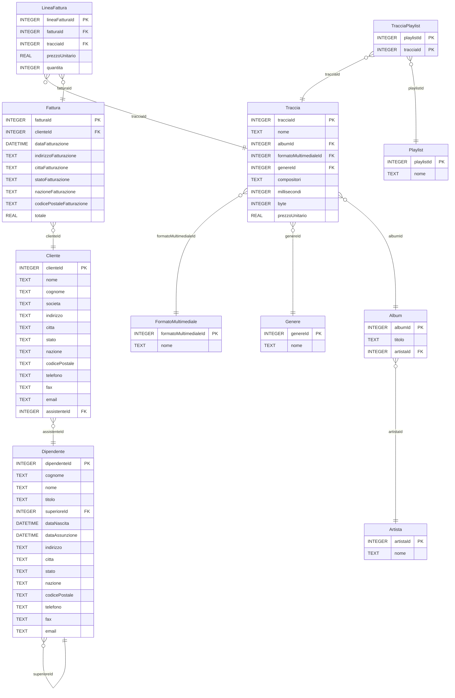

<!--
author:   Gionata Massi

email:    gionata.massi@savoiabenincasa.it

version:  2024-01-13

language: it

narrator: IT Italian Male

comment:  Query SQL su Chinook

import: https://raw.githubusercontent.com/liascript-templates/plantUML/master/README.md

import: https://raw.githubusercontent.com/liaScript/mermaid_template/master/README.md

-->

# Chinook - Esercizi SQL

Alcuni semplici esecizi di scrittura
di interrogazioni  sul database Chinook

Per visualizzare la presentazione apri il link:
https://liascript.github.io/course/?https://raw.githubusercontent.com/gionatamassibenincasa/as-23-24/main/5a-sia/Chinook-README.md


## Query semplici

* Elenca le tracce

  ```sql
  SELECT *
  FROM Traccia
  ```

## Operatori di aggregazione

* Quante tracce ci sono?

  ```sql
  SELECT count(tracciaId) AS numeroTracce
  FROM Traccia;
  ```

* Quanti Mega Byte occupa la traccia più grande?

  ```sql
  SELECT max(byte) / 1024 / 1024 AS MB
  FROM Traccia;
  ```

* Quanti secondi dura la traccia più breve?

  ```sql
  SELECT min(millisecondi) / 1000 AS durataInSecondi
  FROM Traccia;
  ```

* A quanto ammonta il ricavo totale?

  ```sql
  SELECT sum(totale) AS RicavoTotale
  FROM Fattura
  ```

* Qual è la media degli importo delle fatture?

  ```sql
  SELECT avg(totale) AS ImportoMedio
  FROM Fattura;
  ```

* Qual è il dipendente più giovane?

  ```sql
  -- Chi è il dipendente più giovane?
  SELECT MAX(dataNascita), cognome, nome
  FROM Dipendente
  ```

* Qual è l'età media, in anni, dei dipendenti? Assumo che siano nati il primo gennaio

  ```sql
  -- Qual è l'età media, in anni, dei dipendenti?
  SELECT avg(2024 - substr(dataNascita, 1, 4))
  FROM Dipendente
  ```


## Raggruppamenti

* A quanto ammonta il ricavo annuale?

  ```sql
  SELECT 
    sum(totale) AS RicavoAnnuo,
    substr(dataFatturazione, 1, 4) AS AnnoSolare
  FROM Fattura
  GROUP BY AnnoSolare
  ```

* Qual è la media degli importo delle fatture, per anno?

  ```sql
  SELECT 
    avg(totale) AS MediaAnnuaImportoFatture,
    substr(dataFatturazione, 1, 4) AS AnnoSolare
  FROM Fattura
  GROUP BY AnnoSolare
  ```

* Quante tracce vengono vendute allo stesso prezzo?

  ```sql
  -- Quante tracce vengono vendute allo stesso prezzo?
  SELECT
    prezzoUnitario,
    count(prezzoUnitario) AS numeroTracce
  FROM Traccia
  GROUP BY prezzoUnitario
  ```

## Restrizione

* Quali artisti hanno un nome che inizia per 'S'?

  ```sql
  -- Quali artisti hanno un nome che inizia per 'S'?
  SELECT *
  FROM artista 
  WHERE nome LIKE 'S%'
  ```

* Chi sono i clienti italiani?

  ```sql
  -- Chi sono i clienti italiani?
  SELECT nome, cognome
  FROM Cliente
  WHERE nazione = 'Italy';
  ```

* Quali sono gli album incisi dall'artista con id 50?

  ```sql
  -- Quali sono gli album incisi dall'artista con id 50?
  SELECT * 
  FROM Album
  WHERE ArtistaId = 50
  ```


```sql
-- Visualizzare solo i formati utilizzati per almeno
-- 200 delle tracce a catalogo
SELECT count(FM.nome) AS numeroTracce, FM.nome AS formato
FROM Traccia AS T
 INNER JOIN FormatoMultimediale AS FM
    USING (formatoMultimedialeId)
GROUP BY FM.formatoMultimedialeId
HAVING numeroTracce >= 200
```

## JOIN

```sql
SELECT count(*)
FROM
    Traccia
```

```sql
SELECT count(*)
FROM
    FormatoMultimediale
```

```sql
SELECT count(*)
FROM pragma_table_info('Traccia')
```

```sql
SELECT count(*)
FROM pragma_table_info('FormatoMultimediale')
```

```sql
SELECT *
FROM
    Traccia, FormatoMultimediale
WHERE Traccia.formatoMultimedialeId = FormatoMultimediale.formatoMultimedialeId
```

```sql
SELECT *
FROM
    Traccia INNER JOIN FormatoMultimediale
       ON Traccia.formatoMultimedialeId = FormatoMultimediale.formatoMultimedialeId
```

```sql
SELECT *
FROM
    Traccia AS T INNER JOIN FormatoMultimediale AS FM
       ON T.formatoMultimedialeId = F.formatoMultimedialeId
```
```sql
SELECT *
FROM
    Traccia AS T INNER JOIN FormatoMultimediale AS FM
       USING (formatoMultimedialeId)
```
