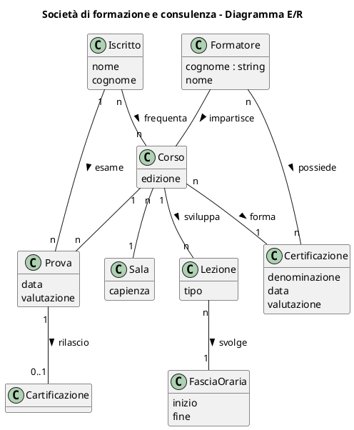
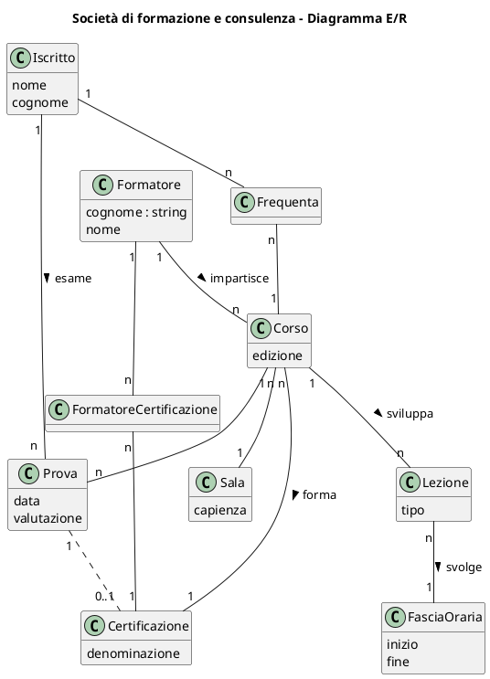
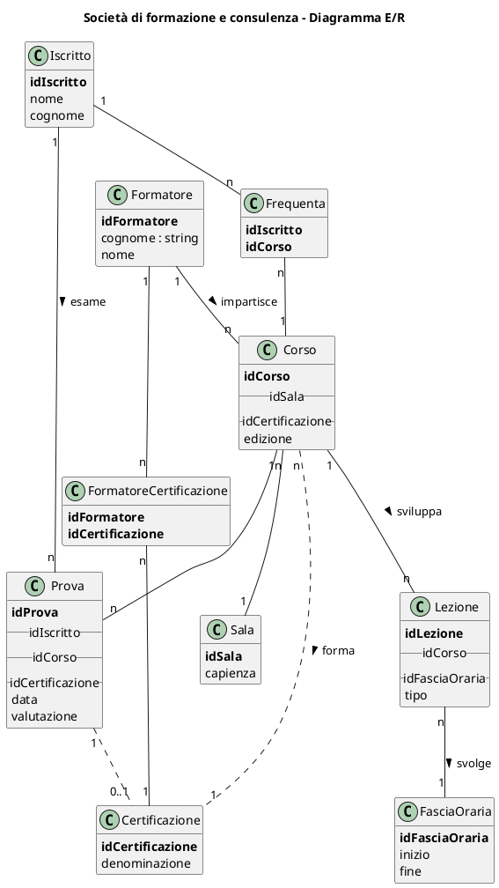

<!--
author:   Gionata Massi

email:    gionata.massi@savoiabenincasa.it

version:  2024-01-20

language: it

narrator: IT Italian Male

comment:  Modellizzazione concettuale dei dati.

-->

## Problema

# Modello concettuale dei dati

Una società di formazione e consulenza sta lavorando sulla gestione informatizzata delle certificazioni per le quali offre corsi formativi e rilascia titoli.

Le **certificazioni** sono di varie tipologie, nello specifico gli attestati della formazione sulla sicurezza nei luoghi di lavoro, la Certificazione Safety-Critical per il Settore Avionico e Aerospaziale, Software Security Certification, Software Developer Certification, Sofware Engineering Certification e Certified Secure Software Lifecycle Professional. La forte richiesta nel settore della Cybersicurezza sta inoltre spingendo il consiglio di amministrazione verso l'ampliamento della propria offerta verso altri corsi propedeutici alla partecipazione alle competizioni nazionali sul tema, le OliCyber e la CyberChallenge.it.  
  
La società eroga i **corsi** tramite i suoi consulenti ed ogni **formatore** può impartire un corso solo se possiede la certificazione oggetto del corso stesso.  
  
Gli **iscritti** ai corsi frequentano le **lezioni** in **sale attrezzate** in base al tipo di corso. Le sale hanno una capienza massima determinata in base alle caratteristiche geometriche della stanza e in base al numero di postazioni attrezzate.  
  
I corsi si sviluppano con più lezioni, teoriche e pratiche, e una prova finale per il rilascio dell'attestato. 
  
Le lezioni sono svolte per gruppi di non meno di 10 partecipanti e non più di 20. Il gruppo si stabilisce ad inizio corso e non è possibile cambiarlo successivamente all'iscrizione.
  
Le lezioni avvengono in fasce orarie e prestabilite che sono comunicate ai partecipanti sul sito web della Società.  
  
Si organizzi un database in grado di fornire le seguenti informazioni:  
  

-   elenco degli iscritti a ogni *edizione* del corso;
-   numero dei posti liberi in ciascun sala;
-   elenco dei corsi tenuti da ogni consulente formatore;  
    
-   elenco dei certificati di ogni formatore.

  
Dati mancanti opportunamente scelti.  
  
La documentazione di progetto da produrre è composta da:  

-   il glossario dei termini,
-   il diagramma delle classi di analisi
-   lo schema della base di dati relazionale.

## Glossario dei termini

| Termine        | Descrizione                           | Sinonimi          | Associazioni |
| -------------- | ------------------------------------- | ----------------- | ------------ |
| Certificazione | Attestazione di comprovate competenze | Titolo, Attestato | Formatore, Corso |
| Corso          | Insieme di obiettivi formativi comuni |                   | Formatore, Certificazione    |
| Formatore      | Colui che può impartire un corso      |                   | Certificazione |

## Un possibile schema E/relazionale

