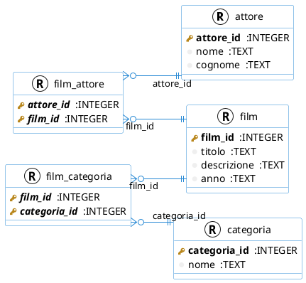

## Compito in classe - 4A SIA - Informatica - 26/11/2024

### Cognome e nome:

Considera il seguente diagramma

che corrisponde alle relazioni:

**attore** (  **attore_id**: INTEGER, nome: TEXT, cognome: TEXT)

**categoria** (  **categoria_id**: INTEGER, nome: TEXT)

**film** (  **film_id**: INTEGER, titolo: TEXT, descrizione: TEXT, anno: TEXT)

**film_attore** (  ***attore_id***: INTEGER -> attore(attore_id), ***film_id***: INTEGER -> film(film_id))

**film_categoria** (  ***film_id***: INTEGER -> film(film_id), ***categoria_id***: INTEGER -> categoria(categoria_id))

Formula le interrogazioni dell'algebra relazionale che rispondono a 10 delle seguenti richieste:

1. Elenca i nomi delle categorie
2. Elenca i titoli dei film
3.  Elenca l'anno di uscita dei film
4. Elenca il titolo e l'anno dei film usciti nel 2006
5. Elenca il nome e il cognome degli attori che si chiamano 'JOHNNY'
6. Elenca il titolo dei film della categoria 'Comedy':
7. Elenca le categorie diverse da 'Horror'
8. Elenca i titoli e la descrizione dei film della categoria 'Horror'
9. Elenca il nome degli attori che hanno recitato in almeno un film della categoria 'Horror'
10. Elenca i titoli dei film e le rispettive categorie
11. Elenca i nomi e i cognomi degli attori che hanno recitato in film della categoria 'Family'
12. Elenca i titoli dei film della categoria 'Family' e i nomi e i cognomi degli attori che hanno recitato
13. Elenca gli attori che hanno recitato in film della categoria 'Family'
14. Elenca le categorie a cui non appartiene alcun film
15. Elenca il nome e il cognome degli attori che non hanno mai recitato in film di genere 'Horror'

Puoi usare RelaX per scrivere e provare le espressioni relazionali: https://dbis-uibk.github.io/relax/calc/gist/ffeaa1bca8f4fd82c50b377d19f70e7d
Se hai problemi a caricare i dati, usa quelli alla pagina: https://dbis-uibk.github.io/relax/calc/gist/ffeaa1bca8f4fd82c50b377d19f70e7d

Consegna una stampa delle espressioni che hai prodotto.
